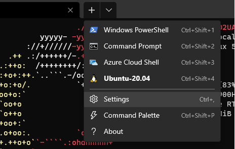
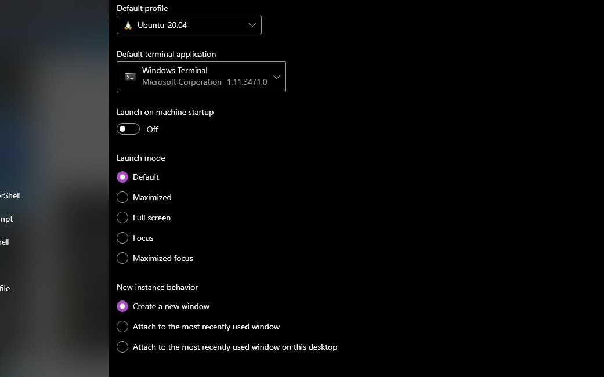

# Getting started with WSL

This guide is assuming that you actually have Windows 10 2004 or higher or Windows 11.

### Enabling and installing WSL

Run the following command in either your windows command prompt or powershell.

```console
c:\> wsl --install
```

Once the installation is completed you'll have to restart your machine. You can do so via
windows command prompt or powershell if you wish.

```console
c:\> shutdown /r
```


### Installing the distro

When WSL is enabled, you can start installing your desired linux distro. The one wish is 
recommended in the example will be `Ubuntu`

To do so, you can search and install your distro via Windows Store app or you can simply do them all via command line (windows command prompt or powershell).

#### Listing the distro

```console
c:\> wsl --list --online
```

#### Installing

```console
c:\> wsl --install -d Ubuntu
```

Like usual, once the installation is complete, you'll need to restart your machine again.


### Using WSL with Terminal

Once the above processes are completed, you can start using WSL simply by running your chosen distro. However, it is recommended that you run it using Microsoft Terminal instead. 

It is a tool that Microsoft created that functions like a standard Linux or iOS terminal where you can open multiple tabs etc.

#### Installing Terminal

Go to the following link or alternatively you can search and download it via Windows Store.

[Install Windows Terminal](https://aka.ms/terminal)

You can read more on Microsoft Windows Terminal on the following link.

[More on Windows Terminal](https://docs.microsoft.com/en-us/windows/terminal/)

#### Setting Linux Distro as default

Once you have Windows Terminal install, you'll notice that it will default itself to Windows command prompt. If you want to change the default profile to your Linux distro, you'll need to click on the `arrow down` button at the top of the app.



You should be able to see the `Settings` option in the list of dropdown. Click that and it will open you the profile page where you can change your default profile.



Select your Linux distro as your default profile and you are good to go. 


